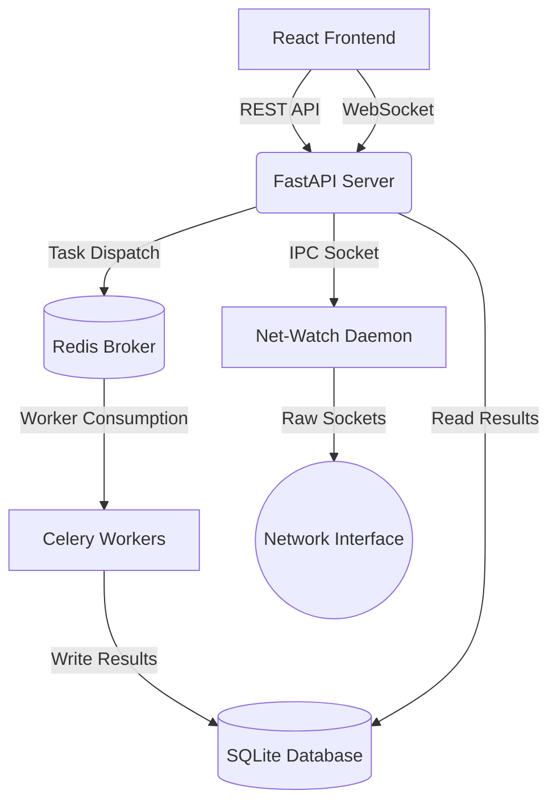

# 👻 PHANTOM v3.0


```text
    ____  __  _____    _   ______________  __  ___
   / __ \/ / / /   |  / | / /_  __/ __ \ \/ / /   |
  / /_/ / /_/ / /| | /  |/ / / / / / / / \/ / /|  |
 / ____/ __  / ___ |/ /|  / / / / /_/ /    / ___ |
/_/   /_/ /_/_/  |_/_/ |_/ /_/  \____/_/|_/_/  |_|
```

**Phantom** is a modern, full-stack, and modular cyber-offensive automation suite and real-time network telemetry dashboard. It features a high-performance Python FastAPI + Celery backend and a sleek, responsive React "glassmorphism" frontend.

> ⚠️ **DISCLAIMER:** Phantom is built strictly for authorized security auditing, educational purposes, and penetration testing on systems you own or have explicit permission to test. The authors are not responsible for any misuse or damage caused by this software.

## 🚀 Features

- **Multi-Module Scanning Engine**: 16 concurrent reconnaissance, exploitation, and auditing modules.
- **Asynchronous Execution**: Powered by Redis and Celery for distributed, non-blocking task execution.
- **Real-Time Network Telemetry**: The `Net-Watch` daemon uses Scapy to monitor interface traffic, identify anomalies (DDoS, Port Scans, Spikes), and stream per-IP live statistics to the frontend via WebSockets.
- **Persistent Scan Archives**: SQLite backend saves all scan results, allowing PDF report generation and history tracking.
- **Task Scheduling**: APScheduler integration allows recurring scans using cron expressions.

## 🏗 Architecture



## 🛠 Installation

### Prerequisites
- Python 3.11+
- Node.js 20+
- Redis Server (running on `localhost:6379`)

### 1. Setup Backend
```bash
cd backend
python -m venv venv
source venv/bin/activate  # On Windows: venv\Scripts\activate
pip install -r requirements.txt
cp .env.example .env      # Edit .env with your Google/GitHub OAuth credentials
```

### 2. Setup Frontend
```bash
cd frontend
npm install
```

### 3. Running the Stack

**Using the Start Script (Windows):**
You can launch all required components (Redis, FastAPI Backend, Celery Worker, React Frontend) automatically using the provided PowerShell script:

```powershell
.\start_phantom.ps1
```

**Manual Setup:**
If you prefer to run them manually, you will need to start four separate processes:

1. **Redis Server**: `redis-server`
2. **FastAPI Backend**: `cd backend && uvicorn app.main:app --reload`
3. **Celery Worker**: `cd backend && celery -A app.tasks.scanner_tasks.celery_app worker --loglevel=info`
4. **React Frontend**: `cd frontend && npm run dev`

Navigate to `http://localhost:5173` to access the development dashboard.

## 🛡️ Available Modules

| Type | Modules |
|---|---|
| **Reconnaissance** | Port Scanner, Subdomain Enum, Directory Enum, DNS Recon, WHOIS Lookup |
| **Exploitation** | SQLi Tester, XSS Detector, SSRF Detector, XXE Detector, CSRF Detector, Open Redirect |
| **Auditing** | CVE Lookup, Header Analyzer, SSL Analyzer, Auth Tester, WAF Detect |

## 🧪 Testing

```bash
# Backend Tests (Pytest)
cd backend && pytest tests/

# Frontend Tests (Vitest)
cd frontend && npm run test
```
